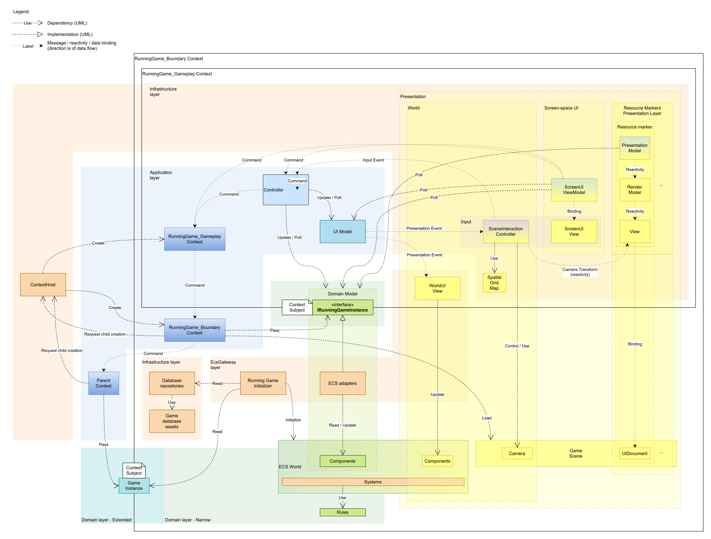

[Work in progress]

Prototype of a management game in Unity with a well-thought-out architecture.

The game is about a hunter-gatherer tribe, surviving on a hexagonal map.

<br>

<!-- TOC -->
* [How to run](#how-to-run)
* [Technologies and architecture features](#technologies-and-architecture-features)
* [Project organization](#project-organization)
* [Architecture](#architecture)
  * [Principles](#principles)
  * [Domain layer](#domain-layer)
    * [Narrow Domain](#narrow-domain)
    * [Extended Domain](#extended-domain)
      * [Game Instance lifecycle](#game-instance-lifecycle)
  * [Application layer](#application-layer)
    * [Context](#context)
    * [Context UI](#context-ui)
    * [Message Bus](#message-bus)
      * [1. Input Event](#1-input-event)
      * [2. Command](#2-command)
      * [3. Domain Event](#3-domain-event)
      * [4. PresentationEvent](#4-presentationevent)
    * [Semantic Context resolution](#semantic-context-resolution)
  * [EcsGateway layer](#ecsgateway-layer)
  * [Infrastructure layer](#infrastructure-layer)
    * [Data access](#data-access)
    * [Screen-space UI](#screen-space-ui)
      * [Data binding](#data-binding)
  * [Bootstrapper](#bootstrapper)
  * [Contexts](#contexts)
    * [`RunningGame_Gameplay` Context](#runninggame_gameplay-context)
      * [Scene Interaction Controller](#scene-interaction-controller)
      * [Model](#model)
      * [Controller](#controller)
      * [Presentation](#presentation)
      * [Resource markers](#resource-markers)
      * [State pattern](#state-pattern)
      * [Input](#input)
  * [Hex grid library](#hex-grid-library)
<!-- TOC -->

<br>


# How to run

Needs Unity 6.3.

- Open the `Main` scene from `My/Scenes/`.
- Run Play mode.

<br>


# Technologies and architecture features

- Unity:
  - DOTS / ECS
  - URP
  - UI Toolkit
- Reactivity (UniMob)
- UniTask

Architecture features:
- Hierarchical flow control
- Application-level message bus
- MVC with Presentation Model
- Automatic convention-based data binding in presentation layer

<br>


# Project organization

```
Assets/
- My/              - Project-specific assets
-- DomainDatabase/ - Assets (ScriptableObjects) that constitute Domain part of Game Database
-- Input/          - Input System configuration
-- Locales/        - Game locale (map) assets
-- Presentation/   - Presentation-related assets
                       and assets that constitute Presentation part of Game Database
--- [Feature subfolders]/
-- Scenes/
-- Scripts/
-- Settings/       - Application and game settings
-- UI/             - Screen-space UI assets
- [Unity and package folders]/
```

Script organization:
```
Scripts/
- App/   - Application

-- Application/   - Application layer
--- Contexts/   - Contexts
     // Each context folder contains at least:
     // - _Infrastructure/   - Infrastructure layer - Context-specific
     //                          (mostly implementations of contracts defined elsewhere)
     // - EntryPoint.cs      - Context entry point
     // - <ContextName>.cs   - Context class

---- Application/   - Application Context
----- [...]

---- RunningGame_Boundary/   - RunningGame_Boundary Context
----- _Infrastructure/
------ Data/   - Data access implementation
------- Database/   - Game Database implementation
         // Each subfolder contains:
         // - Repositories/
         // - ScriptableObjects/
-------- Domain/   - Domain part of Game Database
-------- DomainSettings/   - Domain part of application settings
-------- Presentation/   - Presentation part of Game Database
------- Locale/   - Game locale (map) implementation
------ EcsGateway/   - EcsGateway layer
------- Contracts/   - Contracts defined in this layer
-------- Database/   - Game Database contracts
------- Game.Core/   - Object-oriented interface to game world - implementation
------- Services/   - Service implementations
-------- RunningGameInitializer/
-------- [...]
----- Composition/   - Composition helper
----- Services/   - Service contracts

---- RunningGame_Gameplay/   - RunningGame_Gameplay Context
----- _Infrastructure/
------ EcsGateway/   - EcsGateway layer
------- Views/   - Adapters for ECS-backed Views - implementations
------ UI/   - UI implementation
------- ResourceMarkers/   - Resource markers
------- Screen/   - Screen-space UI
------- SceneInteractionController.cs
----- Controller/
----- Messages/
----- Models/
------ UI/   - UI Model(s)

-- Game/   - Domain layer
--- Core/   - Object-oriented interface to game world - contracts
---- Query/   - Read-only contracts
---- [...]   - Read-write contracts
--- Database/   - Enums for game object types
--- ECS/
---- SystemGroups/   - Definitions of custom SystemGroups
---- [Feature folders]/
       // Possible feature subfolders:
       // - <Sub-feature>/
       // - Authoring/   - Authoring MonoBehaviors for baking prefabs
       // - Components/
       // -- Commands/   - Command components
       // -- Events/   - Event components
       // -- Config/   - Configuration components (added to systems themselves)
       // -- Singletons/   - Singleton components
       // - Initialization/   - Entity initializers, which add components related to the feature
       // - Presentation/   - Presentation "sub-feature"
       // - Rules/   - Plain classes implementing game rules, called from systems
       // - Settings/   - Feature settings
       // - Systems/
--- Meta/   - Extended/Meta Domain

-- Infrastructure/   - Infrastructure layer - shared part
--- Data/   - Data-access-related
--- EcsGateway/   - EcsGateway layer
---- Contracts/   - Contracts defined in this layer
---- Services/   - Service implementations
--- Shared.Contracts/   - Contracts shared between Contexts and/or between EcsGateway and
                            general Infrastructure sublayers
---- Database/
----- Presentation/   - Presentation Database repository contracts
---- Services/   - Service contracts
--- Bootstrap.cs   - Bootstrap MonoBehaviour

- Lib/   - Libraries
-- AppFlow/   - Hierarchical Flow Control framework
-- AppFlow.Resolution/   - Semantic Context resolution
-- AppFlow.Unity/   - Unity-specific extensions for AppFlow
-- Grid/   - Hex grid library - topological classes
-- Grid.Spatial/   - Hex grid library - spatial classes
-- Grid.Visual/   - Hex grid library - visual extensions
-- Math/   - Math utilities
-- UICore/   - Lightweight UI support abstractions
--- Gui/   - View composition support
--- Mvvm/   - Convention-based data binding
-- UICore.Unity/   - Unity implementation of UICore
-- Util/   - General utilities
```

<br>


# Architecture

[](Docs/Architecture_diagram.svg)

<br>


## Principles

- Clean Architecture (and Screaming Architecture) adapted for use with ECS.
- Separation of game logic and presentation. Since the game is not tightly
coupled to physics or animation, this is at least partially achievable.
- SOLID.

<br>


## Domain layer

The Domain is separated into two sub-layers: Narrow and Extended.<br>
The Narrow Domain comprises everything inside the game world.<br>
The Extended/Meta Domain comprises the game-related entities outside the game
world, such as Game Instance, Game Instance Setup.

<br>


### Narrow Domain

The (Narrow) Domain mostly resides in the ECS realm, with few pieces of meta
info (such as `GamePhase`) residing in the object-oriented realm.

The ECS components (except presentation-related) are considered Domain entities
despite not being plain classes.

An effort is made to extract game rules from ECS systems into plain classes
invoked from those systems, although this is only partially achivable.

The Domain layer defines an object-oriented interface to be used by the
Application layer. This interface is implemented in the EcsGateway layer.

<br>


### Extended Domain

The term "game" is generally avoided due to its vagueness.

The main entity the player interacts with is the Game Instance. This is what is
created when the player hits "New Game" (currently it is created on application
start).

<br>

#### Game Instance lifecycle

A Game Instance (GI) holds a GI Phase enum value.

1. After creation, the Phase is Created.
2. The GI is set up, i.e., its GI Setup object is populated. The Phase becomes
SetUp.
3. After the user hits "Start", the Phase becomes Started.<br>
A GI can remain Started across multiple application sessions. Game state is
persisted in GI Snapshots (saves). A GI maintains a list of its Snapshots.<br>
The running state is represented by a separate Running Game Instance object.
When a Running GI starts, it is initialized using:
    - the GI Setup if the GI is new;
    - a Snapshot if the GI has any.
4. After the game ends, the Phase becomes Finished, and the GI is supplied
with a GI Result object.

(Only the Game Instance Setup is implemented currently.)

<br>


## Application layer

On the application level the system is organized as a Hierarchical Control
Architecture, conceptually closest to a UML Hierarchical State Machine and, to
some extent, a State Stack.

The architecture is supported by a custom `AppFlow` framework.

<br>


### Context

The architectural unit is a Control Context, or simply a Context.

A Context represents a scope of application state and behavior, defining what
the user can see and do, which systems are active, and how transitions are
handled while the application is in that state.

Examples of Contexts are an Application, a Main Menu, a Running Game Instance.
A Context can, in principle, be as small as a Unit Info Panel, although there
are no such examples currently.

A Context can have one or more children Contexts, so the application state is
organized in a tree-like structure. A Context controls the lifecycle of its
children and provides common data and services for them.

All instantiated Contexts are active simultaneously in the sense that each
handles commands relevant for its level. For example, the root Application
Context is always active and handles the `ExitApplication` command.

A Context can have a UI, but it is not mandatory. A Context constitutes a
message passing scope for the UI components inside it.

Each Context resides in a separate module and has its own Composition Root.
(Currently all modules are in the same assembly.)

<br>


### Context UI

Each Context has (if any) its own UI, which potentially can have a distinct
architecture. However, the pattern supported by the framework is MVC (not just
the classic form, but also extended variants).

The framework does not currently mandate anything about the Model. However, it
is implied that the Model consists of two parts:
- the Domain Model - holds game state;
- the UI Model - holds transient UI state, such as the currently selected
object.

A Context can have several Views.<br>
This is a convenience, considering that multiple presentation technologies
can be used simultaneously: GameObjects, Entity Graphics, screen-space UI,
world-space UI.

A View can be a composite consisting of a Presentation Model and an actual
View.

<br>


### Message Bus

The framework provides a Message Bus.<br>
(Note that this is an Application-level Bus, not a Domain one.)

Although communication between the UI components inside a Context can also be
implemented using polling, cross-context communication is done only via
messages.

Currently there are four types of messages.

<br>

#### 1. Input Event

A semantic event (e.g., "object clicked"), which is a result of low-level input
interpretation in the scene context. An event does not represent a meaningful
user action; it can translate to different actions depending on the current UI
state.

The framework does not specify which component emits Input Events. See below
for the current implementation details.

Dispatched to the Controller.

<br>

#### 2. Command

A meaningful user action.

Emitted by:
- the View(s);
- the Controller.

If a View shows only the widgets of the Commands relevant to the current state
and hides or disables non-relevant ones, i.e., if it is unable to emit an
invalid Command, it directly emits Commands, otherwise it emits Input Events.

The Controller interprets Input Events depending on the current state and emits
Commands accordingly.

Conceptually, there are two kinds of Commands, although currently they are not
distinguished technically:
- A Local Command instructs to update the Context's Model (either the Domain or
UI one);
- A Navigation / Flow Command leads to changes in the Context hierarchy.

A Command is dispatched to a single handler method, which is resolved in the
following order:
- the Controller of the current Context;
- the current Context;
- each parent Context in turn.

This way, for example, the root Application Context can handle an
`ExitApplication` Command emitted in one of the descendant Contexts.

<br>

#### 3. Domain Event

Emitted by the Domain Model (the game world).

Dispatched to the Controller and the Views.

Currently is not used.

<br>

#### 4. Presentation Event

A presentation-related event.

Can be of one of two types (currently not distinguished technically):
- A state change (e.g., the highlighted tile changed);
- A Presentation Request - a request to do a presentation action (e.g., focus
the camera on an object).

Emitted by the UI Model.

Dispatched to the View(s).

<br>


### Semantic Context resolution

(The purpose of this feature is modding.<br>
The feature is in early stages, and is not used to its purpose currently.)

Contexts are resolved using semantic descriptors (similar to Intents in
Android).

A descriptor is a collection of fields describing the Context's purpose and its
parameters. The most important and the only mandatory field is the Subject. The
Context's Subject is what this Context is about: the entire application, a list
of save files to select, a running game instance.

Every Context module provides a Capability Descriptor, which are collected by
the Context Host.

When a Context needs to instantiate a child, it calls the Context Host and
supplies a Request Descriptor. The descriptor contains, along with the semantic
info, the argument values to pass to the child. The Context Host resolves the
child by matching the Request against the available Capabilities and
instantiates it.

<br>


## EcsGateway layer

Since the Domain layer mostly resides in the ECS world, while the Application
layer is object-oriented, a glue layer is needed to connect two different
paradigms. It is called EcsGateway.

By responsibility, the EcsGateway belongs to Infrastructure; however, unlike in
classic Clean Architecture, it resides inside the application core.

The main feature of the EcsGateway is the implementation of the object-oriented
interface to the game world (`IRunningGameInstance`), defined in the Domain
layer.

<br>


## Infrastructure layer

### Data access

The game data currently consists of:
- the Game Database assets, storing the parameters of the game entities and
systems;
- the Locale (map) assets.

All data is abstracted by Repository classes.

<br>


### Screen-space UI

The screen-space UI is implemented in UI Toolkit.

A single UI Document is used (rather than one document per UXML). The UI
Document component is attached to the `Bootstrap` GameObject (see below).
Initially, it is empty (has no source asset). Source assets are set dynamically
as the foreground Context changes (currently there is only one).

#### Data binding

There is a lightweight library `UICore.Mvvm`, supporting automatic
convention-based data binding between ViewModels and Views. The convention
defines the rules for the names of the ViewModel properties and the View
elements, which allows to bind them automatically.

<br>


## Bootstrapper

The bootstrapping setup consists of the `Main` scene, which has the `Bootstrap`
GameObject with the following components:
- the `Bootstrap` script;
- an empty UI Document, acting as a container for dynamically loaded
screen-space UI UXMLs.

The `Bootstrap` script:
- holds the reference to the Application Settings asset;
- creates host services, such as Context Host, Message Dispatcher;
- instantiates and starts the root Application Context;
- maintains the Context update loop;
- maintains an additional UniMob atom synchronization point in LateUpdate(),
complementing the automatic one in Update().

<br>


## Contexts

Currently there are three Contexts:
- `Application` - currently just creates a Game Instance with the configured
locale (map) and starts the `RunningGame_Boundary` Context.
- `RunningGame_Boundary` - loads the `Game` scene, initializes the ECS world,
and starts the `RunningGame_Gameplay` Context.
- `RunningGame_Gameplay` - handles gameplay in the already initialized world.

<br>


### `RunningGame_Gameplay` Context

Currently there is only one Context with UI - the `RunningGame_Gameplay`, which
handles gameplay.

The UI is based on MVC with extensions.

<br>

#### Scene Interaction Controller

There is one component staying partially apart from MVC - the Scene Interaction
Controller. It handles scene-level interaction and has two responsibilities:
- camera navigation;
- translation of raw input into scene-semantic Input Events (e.g., hovering or
clicking on objects).

<br>

#### Model

The Domain Model is represented by the `IRunningGameInstance` interface. It
is passed to the Context by its parent as the Context Subject.

The UI Model holds data such as the current UI mode and the currently
highlighted object.

Currently other UI components poll the models every frame to update themselves.

<br>

#### Controller

The Controller:
- receives Input Events from the Scene Interaction Controller and translates
them into Commands;
- receives Commands from the Views.

Then it uses the Commands to update the Domain Model and the UI Model.

<br>

#### Presentation

The Presentation layer (the 'V' in MVC) consists of the following.

- The Scene Interaction Controller, which handles Presentation Requests (like
camera focusing).

- The screen-space UI, which is composite: it consists of the ViewModel and the
View, connected by data binding (using the `UICore.Mvvm` library for automatic
convention-based binding).<br>
The ViewModel does not modify the Model as in MVVM, instead it emits Commands
to be processed in the Controller as the View does in MVC.

- The World UI View, handling ECS-backed world-space UI (e.g., tile
highlighting).

- The resource markers presentation layer (see below).

<br>

#### Resource markers

Resource markers are billboards rendered in screen space but anchored in world
space. A marker dynamically changes its size and shape depending on the
remaining resource quantity.

Markers are implemented using UI Toolkit. Each marker is a GameObject with a
UIDocument component.

Resource marker code consists of three layers.
- The Presentation Model holds semantic information about the marker.
This information is abstracted from domain concepts: e.g., the visual magnitude
of the marker, not the actual resource quantity.
- The Render Model holds graphical information (shape parameters), derived from
the Presentation Model. It is abstracted from the presentation technology.
- The View displays the marker using specific presentation technology (UI
Toolkit with data binding). It tracks the camera to adjust the world position of
the billboard.

The connections between the layers and between the camera transform and the View
are reactive (via the UniMob library).

As an optimization, marker GameObjects are reused when the set of resources
changes at the start of a new year period.

<br>

#### State pattern

The Context has a central UI mode, derived from the UI Model.

Certain components of the Context (the Controller, the screen-space UI
ViewModel) use the State pattern to manage their behavior based on the UI mode.

<br>

#### Input

The Context features layered input processing:
- the Scene Interaction Controller translates raw input into semantic Input
Events (e.g., "tile clicked");
- the Controller translates Input Events into Commands depending on the current
UI mode (e.g., if a tile clicked while in the Camp Placing mode, emit a
PlaceCamp Command).

<br>


## Hex grid library

The hexagonal grid library types are organized by two axes:
- topological / spatial;
- grid / map.<br>
<br>

- The topological types represent the topology of a grid.<br>
They are located in the `Grid` namespace.
- The spatial types represent the spatial layout of a grid.<br>
There are 2D and 3D versions.<br>
They are located in the `Grid.Spatial` namespace.
- The grid types represent an unbounded grid.
- The map types represent a bounded (e.g., rectangular) grid.

Also there is a `Grid.Visual` namespace, containing visual extensions for the
spatial types.
